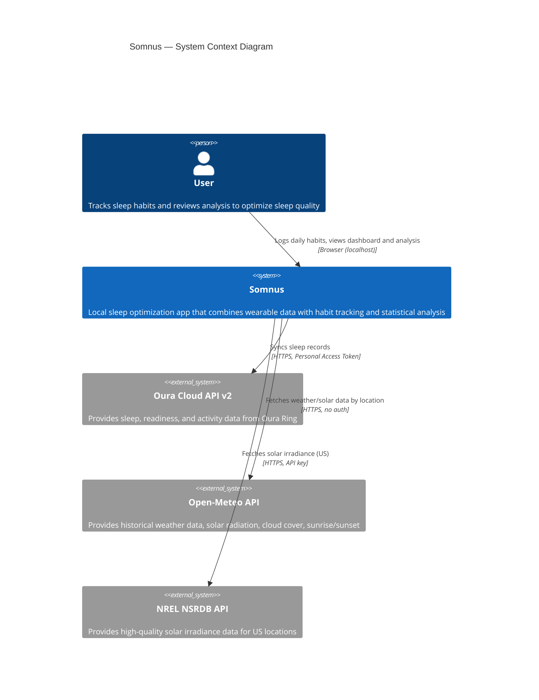
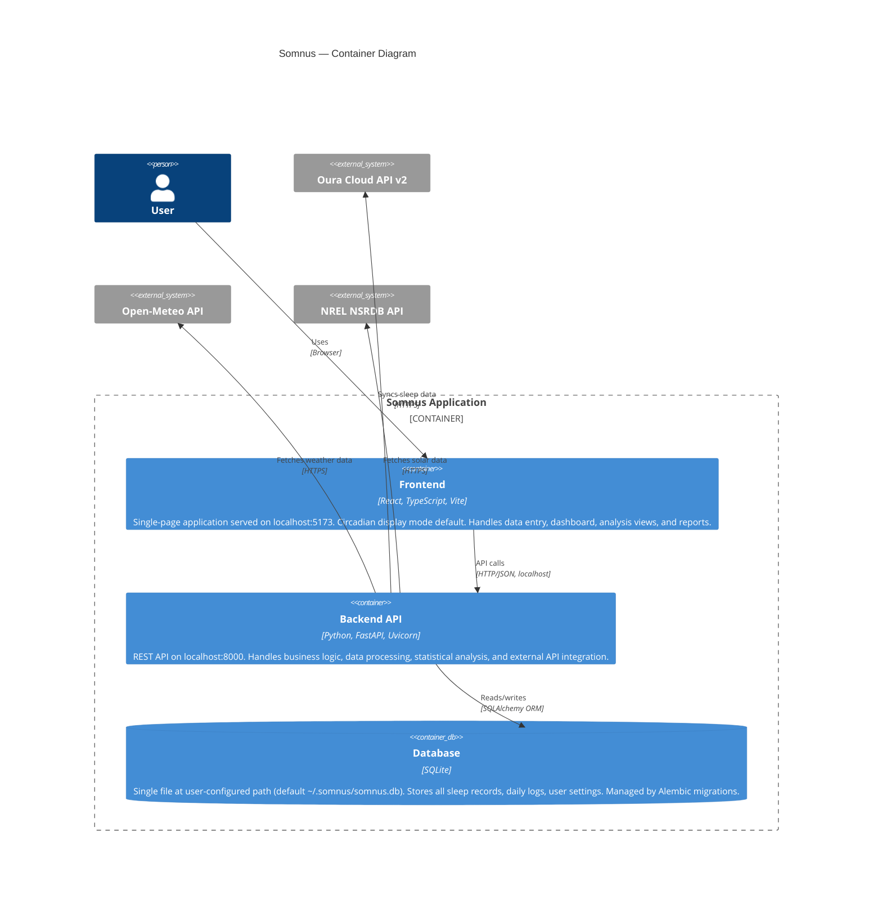

# Somnus — Architecture

This document describes the architecture of Somnus using C4 model diagrams (rendered in Mermaid). It is a living document — updated with every commit that changes the system's structure.

> **Security view:** the trust boundaries and adversary model layered over this decomposition live in [docs/THREAT_MODEL.md](docs/THREAT_MODEL.md). It is built element-by-element against the containers and data flows below and must be kept in sync with them.

---

## Level 1: System Context

Who uses Somnus and what external systems does it interact with?



---

## Level 2: Container Diagram

What are the major runtime components and how do they communicate?



---

## Level 3: Component Diagram — Backend

What services and routers make up the backend?

```mermaid
C4Component
    title Somnus Backend — Component Diagram

    Container_Boundary(backend, "Backend API") {

        Component(main, "Application Entry", "FastAPI", "CORS config, startup hooks, auto-migration on launch")

        ComponentDb(db, "Database Layer", "SQLAlchemy + Alembic", "ORM models, session management, configurable DB path, migration runner")

        Component_Boundary(routers, "API Routers") {
            Component(daily_log_router, "Daily Log Router", "FastAPI Router", "CRUD for all daily entry types. Copy-day endpoint. Date-range queries.")
            Component(dashboard_router, "Dashboard Router", "FastAPI Router", "Single BFF endpoint returning aggregated sleep overview data.")
            Component(oura_router, "Oura Router", "FastAPI Router", "Sync endpoint. Token management. Bulk historical import.")
            Component(analysis_router, "Analysis Router", "FastAPI Router", "Correlation, regression, and timing analysis endpoints. Confidence intervals.")
            Component(recommendations_router, "Recommendations Router", "FastAPI Router", "Personalized recommendations. Experiment tracking.")
            Component(export_router, "Export Router", "FastAPI Router", "CSV, JSON, SQLite export. Date-range filtering.")
            Component(reports_router, "Reports Router", "FastAPI Router", "Weekly and monthly summary reports. HTML export.")
        }

        Component_Boundary(services, "Services") {
            Component(dashboard_svc, "Dashboard Service", "Python", "BFF aggregation: sleep record, trends, stage averages, consistency metrics, streak, red light summary, caffeine entries.")
            Component(oura_client, "Oura Client", "httpx", "Oura API v2 integration. Sleep, readiness, activity data.")
            Component(caffeine_svc, "Caffeine Model", "Python", "Exponential decay pharmacokinetics. Sensitivity-adjusted half-life.")
            Component(sleep_timing_svc, "Sleep Timing", "Python", "Chronotype inference. Optimal bedtime window. 3-component consistency model (σ, δ, Δ).")
            Component(sleep_stages_svc, "Sleep Stages", "Python", "Age-adjusted REM/deep targets. Deficiency detection. 7-day rolling averages.")
            Component(sunlight_svc, "Sunlight", "httpx", "Morning light tracking. Solar intensity estimation via Open-Meteo/NREL.")
            Component(red_light_svc, "Red Light", "Python", "Dose calculation (J/cm²). Panel presets. Inverse square law adjustment.")
            Component(nap_svc, "Nap Analysis", "Python", "Nap impact on subsequent night. Timing/duration segmented analysis.")
            Component(seasonal_svc, "Seasonal", "Python", "Daylight hours, season, DST from zip+date. Regression covariates.")
            Component(validation_svc, "Validation", "Python", "Input range checks. Outlier detection (z-score). Soft warnings vs hard rejects.")
            Component(stats_engine, "Stats Engine", "scipy, statsmodels", "Correlations. Dynamic regression with lagged variables. Multiple targets. ACF/PACF. Stationarity.")
            Component(recommender, "Recommender", "Python", "Rule engine combining regression + science thresholds. Experiment suggestions.")
            Component(report_svc, "Report Service", "Python", "Weekly and monthly report computation. On-the-fly aggregation. HTML rendering with circadian palette.")
        }

        Component(reference_data, "Science Reference Data", "Python", "Evidence-based thresholds, targets, and guidance for all tracked factors.")
    }

    Rel(main, daily_log_router, "Mounts")
    Rel(main, dashboard_router, "Mounts")
    Rel(main, oura_router, "Mounts")
    Rel(main, analysis_router, "Mounts")
    Rel(main, recommendations_router, "Mounts")
    Rel(main, export_router, "Mounts")
    Rel(main, reports_router, "Mounts")

    Rel(daily_log_router, db, "CRUD")
    Rel(daily_log_router, validation_svc, "Validates input")
    Rel(dashboard_router, dashboard_svc, "Aggregates data")
    Rel(dashboard_svc, db, "Reads records")
    Rel(dashboard_svc, reference_data, "Age targets, thresholds")
    Rel(oura_router, oura_client, "Delegates sync")
    Rel(oura_router, db, "Writes sleep records")
    Rel(analysis_router, stats_engine, "Runs analysis")
    Rel(analysis_router, sleep_timing_svc, "Timing metrics")
    Rel(analysis_router, sleep_stages_svc, "Stage analysis")
    Rel(analysis_router, nap_svc, "Nap impact")
    Rel(analysis_router, seasonal_svc, "Covariates")
    Rel(recommendations_router, recommender, "Generates recommendations")
    Rel(recommender, stats_engine, "Reads analysis results")
    Rel(recommender, reference_data, "Science thresholds")
    Rel(reports_router, report_svc, "Generates reports")
    Rel(report_svc, db, "Reads records")
    Rel(report_svc, dashboard_svc, "Reuses consistency")
    Rel(report_svc, stats_engine, "Top factors")
    Rel(report_svc, recommender, "Active experiment")
    Rel(sunlight_svc, openmeteo, "Weather API")
    Rel(sunlight_svc, nrel, "Solar API")
```

---

## Level 3: Component Diagram — Frontend

What components make up the frontend SPA?

```mermaid
C4Component
    title Somnus Frontend — Component Diagram

    Container_Boundary(frontend, "Frontend SPA") {

        Component(router, "Router", "react-router-dom v7", "URL-based routing. /onboarding, /log/:date, /dashboard, /analysis, /recommendations, /reports, /settings. Layout guard checks onboarding status.")

        Component(layout, "Layout", "React", "Nav header with app title, dashboard, analysis, recommendations, reports, and settings links. Onboarding gate — redirects based on settings.onboarding_completed.")

        Component_Boundary(onboarding, "Onboarding Wizard") {
            Component(wizard, "OnboardingWizard", "React", "6-step wizard: Welcome, Oura, SleepProfile, TrackingSetup, DataStorage, Done. Per-step PATCH to settings.")
        }

        Component_Boundary(daily_log, "Daily Log") {
            Component(daily_log_page, "DailyLogPage", "React", "Assembles date nav, sections, caffeine chart, notes, save button. Whole-log PUT on save.")
            Component(date_nav, "DateNavigator", "React", "Date display with prev/next/today. Date in URL param.")
            Component(copy_day, "CopyDayButton", "React", "Date picker modal to copy entries from another day.")
            Component(warning_banner, "WarningBanner", "React", "Dismissible validation warnings from backend.")
            Component(sections, "Entry Sections", "React", "11 collapsible sections: Caffeine, Meals, Supplements, Habits, Stimulating, Sexual Activity, Pre-Bed Rituals, Naps, Sunlight, Red Light, NSDR.")
        }

        Component_Boundary(dashboard_view, "Dashboard") {
            Component(dashboard_page, "DashboardPage", "React", "Card grid layout aggregating sleep overview: score, stages, trends, consistency, streak, red light, caffeine.")
            Component(sleep_score_card, "SleepScoreCard", "SVG", "Circular score ring with key metric pills (HRV, HR, efficiency, readiness).")
            Component(stage_bar, "StageBreakdownBar", "SVG", "Horizontal stacked bar for deep/REM/light with age-adjusted target comparison.")
            Component(sparklines, "TrendSparklines + Sparkline", "SVG", "2x2 grid of 7-day trend sparklines. Reusable Sparkline component.")
            Component(consistency, "ConsistencyMeter", "SVG", "Bedtime dot plot with σ/δ/Δ metric pills. Weekend dots distinguished.")
            Component(streak, "LoggingStreak", "React", "Consecutive logging day count with color coding.")
            Component(red_light, "RedLightSummary", "React", "Weekly session count, dose, on-track badge.")
        }

        Component_Boundary(settings_page, "Settings Page") {
            Component(settings_pg, "SettingsPage", "React", "Four-section settings: Oura connection, Profile, Red Light Panels, Display mode.")
            Component(oura_section, "OuraSection", "React", "Token input (PAT), sync button, last sync display, sync results.")
        }

        Component_Boundary(analysis_view, "Analysis") {
            Component(analysis_page, "AnalysisPage", "React", "Orchestrates sub-views based on data sufficiency. Phase-gated: correlations (14d), regression (50d), timing (30d).")
            Component(data_status, "DataStatus", "React", "Per-variable day counts and phase unlock indicators.")
            Component(corr_list, "CorrelationList", "React", "Ranked factor list with r-values, p-values, confidence levels.")
            Component(corr_heatmap, "CorrelationHeatmap", "SVG", "Predictor x outcome matrix. Amber/red color scale.")
            Component(coeff_chart, "CoefficientChart", "SVG", "Horizontal bars with 95% CI whiskers per regression model.")
            Component(regression_summary, "RegressionSummary", "React", "R-squared, diagnostics, and model warnings.")
            Component(timing_view, "TimingView", "React", "Chronotype label, optimal bedtime window, social jet lag.")
            Component(nap_view, "NapImpactView", "React", "Segmented nap timing x duration grid with onset latency deltas.")
            Component(explainer, "Explainer", "React", "Collapsible 'How to read' section with hedged language.")
        }

        Component_Boundary(recommendations_view, "Recommendations") {
            Component(recommendations_page, "RecommendationsPage", "React", "Orchestrates recommendation cards and experiment tracker. Gated on 50+ days (Phase B). Hedged language throughout.")
            Component(rec_card, "RecommendationCard", "React", "Category badge, title, body, evidence level pill, start experiment button.")
            Component(experiment_tracker, "ExperimentTracker", "React", "Progress bar, baseline vs result metric pills, complete/abandon buttons.")
            Component(top_recs, "TopRecommendations", "React", "Dashboard card showing top 3 recommendations with link to full page.")
        }

        Component_Boundary(reports_view, "Reports") {
            Component(reports_page, "ReportsPage", "React", "Orchestrates weekly/monthly views with tab toggle. Period navigation. Loading/error/insufficient-data guards.")
            Component(weekly_view, "WeeklyReportView", "React", "Period navigator, metrics comparison, consistency pills, top factors, export link.")
            Component(monthly_view, "MonthlyReportView", "React", "Period navigator, metrics, best/worst nights, stage compliance, experiment progress, weekly summaries.")
            Component(metrics_card, "MetricsComparisonCard", "React", "2x2 grid: score, HRV, deep, REM. Current value + trend arrow + prior value.")
            Component(factors_card, "TopFactorsCard", "React", "Top positive/negative factor with hedged language and r-value.")
            Component(nights_card, "BestWorstNightsCard", "React", "Side-by-side best/worst night with contributing factor tags.")
            Component(compliance_card, "StageComplianceCard", "React", "Deep/REM target hit rates. Hidden when no age set.")
        }

        Component(caffeine_chart, "CaffeineChart", "SVG", "Inline SVG decay curve. Client-side exponential decay math. Bedtime marker and 100mg threshold.")

        Component_Boundary(api_layer, "API Client") {
            Component(api_client, "fetchJson/fetchVoid", "TypeScript", "Thin fetch wrapper with JSON parsing and ApiError handling.")
            Component(api_modules, "Endpoint Modules", "TypeScript", "dailyLog, dashboard, analysis, recommendations, reports, settings, redLightPanels, oura API functions.")
        }

        Component(shared, "Shared Components", "React", "TimePicker, NumberInput, SelectInput, SliderInput, Toggle.")

        Component(hooks, "Custom Hooks", "React", "useSettings, useDailyLog, useDashboard, useAnalysisStatus, useCorrelations, useRegression, useTiming, useNaps, useRecommendations, useWeeklyReport, useMonthlyReport, useOnboarding, useDateNavigation, useCaffeineDecay.")
    }

    Rel(router, layout, "Renders")
    Rel(layout, wizard, "Onboarding route")
    Rel(layout, daily_log_page, "Log route")
    Rel(layout, dashboard_page, "Dashboard route")
    Rel(layout, analysis_page, "Analysis route")
    Rel(layout, recommendations_page, "Recommendations route")
    Rel(layout, reports_page, "Reports route")
    Rel(layout, settings_pg, "Settings route")
    Rel(dashboard_page, caffeine_chart, "Renders when caffeine entries exist")
    Rel(daily_log_page, sections, "Renders")
    Rel(daily_log_page, caffeine_chart, "Renders when caffeine entries exist")
    Rel(daily_log_page, date_nav, "Renders")
    Rel(hooks, api_modules, "Calls")
    Rel(api_modules, api_client, "Uses")
```

---

## Data Flow

### Daily Entry Flow
```
User → Frontend (DailyLog form) → POST /api/daily-log/{date}
  → Validation Service (range checks, soft/hard warnings)
  → SQLAlchemy ORM → SQLite DB
```

### Oura Sync Flow
```
User → Frontend (Settings, "Sync") → GET /api/oura/sync?start=&end=
  → Oura Client → Oura Cloud API v2 (HTTPS, PAT auth)
  → Response validation → SleepRecord model → SQLite DB
```

### Dashboard Flow
```
User → Frontend (DashboardPage) → GET /api/dashboard
  → Dashboard Service aggregates:
    - Latest SleepRecord (today or yesterday)
    - 7-day trend data (scores, HRV, stages)
    - Stage averages vs age-adjusted targets
    - Bedtime consistency (σ, δ, Δ) from SleepRecord bedtimes
    - Logging streak from DailyLog dates
    - Red light weekly summary
    - Today's caffeine entries
  → Single JSON response → Frontend renders card grid
```

### Analysis Flow
```
User → Frontend (AnalysisPage) → GET /api/analysis/status
  → Stats Engine builds central DataFrame (SleepRecord ⨝ DailyLog aggregates)
  → Returns per-variable day counts and phase unlock status

Phase A (≥14 days): GET /api/analysis/correlations
  → Stats Engine filters sick days, computes pairwise Pearson/Spearman r
  → Returns sorted by |r|, with p-values, confidence levels, sample sizes

Phase B (≥50 days): GET /api/analysis/regression
  → Stats Engine fits OLS per outcome (sleep_score, deep, rem, hrv)
  → Standardized coefficients, 95% CIs, VIF, ADF stationarity, ACF checks
  → Returns regression results with diagnostics

Phase C (≥30 bedtimes): GET /api/analysis/timing
  → Sleep Timing Service infers chronotype from sleep midpoint
  → Computes social jet lag (weekday vs weekend midpoints)
  → Optimal bedtime window from top-quartile sleep scores

GET /api/analysis/naps
  → Nap Analysis Service segments by timing × duration
  → Compares each segment to no-nap baseline onset latency
```

### Recommendations Flow
```
User → Frontend (RecommendationsPage) → GET /api/recommendations
  → Recommender Service builds central DataFrame
  → Checks Phase B (≥50 days) — returns insufficient_data if not met
  → Runs 4 generators:
    - Data-Driven: regression coefficients → hedged action text
    - Science Threshold: last-14-day averages vs known thresholds
    - Untried: factors with <7 days → tracking suggestions
    - Timing: social jet lag, bedtime vs optimal window
  → Dedup, priority sort, cap at 20
  → Returns recommendations + active experiment (with computed metrics)

User → "Start experiment" → POST /api/experiments
  → Creates Experiment row (409 if one already active)
  → 14-day default duration, single-factor isolation

GET /api/experiments/{id}
  → Computes baseline (14d before start) and result (start to today) metrics at read time
  → Auto-completes experiments past their end_date
```

### Reports Flow
```
User → Frontend (ReportsPage) → GET /api/reports/weekly?year=&week=
  → Report Service computes on-the-fly:
    - SleepRecords + DailyLogs in ISO week range
    - Metric averages (score, HRV, deep, REM)
    - Prior week comparison + trend arrows
    - Bedtime consistency (reuses dashboard_service)
    - Top factors (full-dataset correlations via stats_engine)
    - Logging completeness (DailyLog count)
  → Returns WeeklyReportResponse

GET /api/reports/monthly?year=&month=
  → Report Service computes:
    - Same metrics as weekly, monthly range
    - Best/worst nights with contributing factors from DailyLog sub-entries
    - Stage compliance (deep/REM vs age-adjusted targets)
    - Active experiment progress
    - Weekly summaries (calls get_week_report per ISO week in month)
  → Returns MonthlyReportResponse

GET /api/reports/weekly/export-html
  → Renders HTML with inline circadian CSS, returns text/html StreamingResponse
```

### Caffeine Projection (Client-Side)
```
User adds caffeine entry → Frontend computes in real-time:
  remaining_mg = Σ(dose × 0.5^(hours_elapsed / half_life))
  → Renders chart with bedtime marker
```

---

## Key Architectural Constraints

1. **Fully local** — No telemetry, no cloud storage, no accounts. All data stays on the user's machine.
2. **Configurable DB path** — SQLite file location is user-controlled (supports encrypted containers).
3. **Missing data tolerance** — NULL means "not recorded," never "didn't happen." Analysis excludes NULLs per-variable.
4. **Circadian-safe UI** — Default display mode uses amber/red wavelengths only (>590nm). No blue, green, or white light emission.
5. **Migration-first schema** — All DB changes go through Alembic. No manual SQL. Auto-runs on startup.
