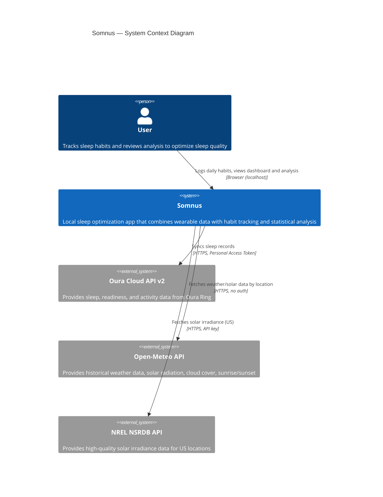
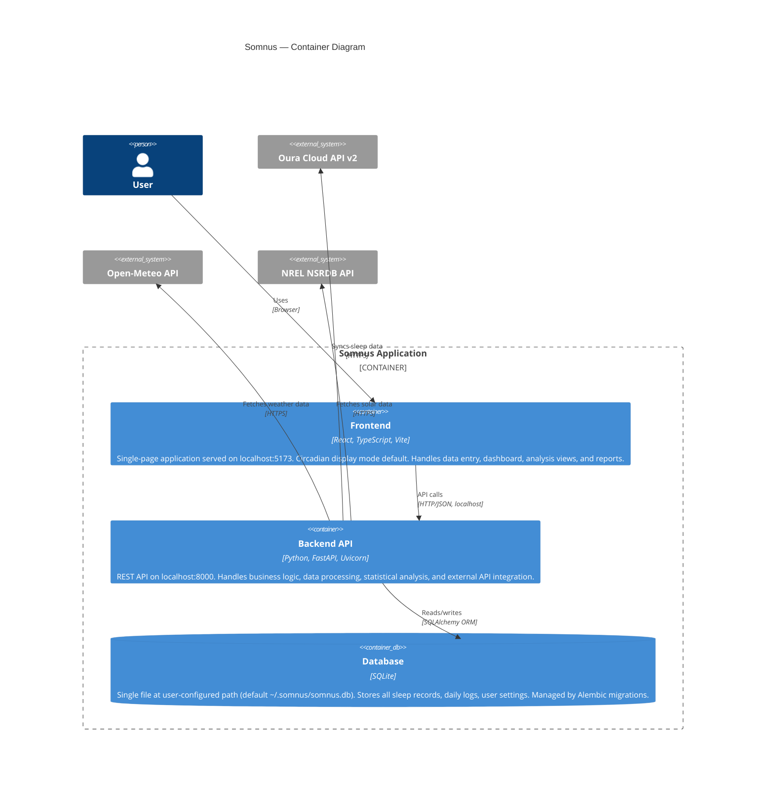

# Somnus — Architecture

This document describes the architecture of Somnus using C4 model diagrams (rendered in Mermaid). It is a living document — updated with every commit that changes the system's structure.

---

## Level 1: System Context

Who uses Somnus and what external systems does it interact with?



---

## Level 2: Container Diagram

What are the major runtime components and how do they communicate?



---

## Level 3: Component Diagram — Backend

What services and routers make up the backend?

```mermaid
C4Component
    title Somnus Backend — Component Diagram

    Container_Boundary(backend, "Backend API") {

        Component(main, "Application Entry", "FastAPI", "CORS config, startup hooks, auto-migration on launch")

        ComponentDb(db, "Database Layer", "SQLAlchemy + Alembic", "ORM models, session management, configurable DB path, migration runner")

        Component_Boundary(routers, "API Routers") {
            Component(daily_log_router, "Daily Log Router", "FastAPI Router", "CRUD for all daily entry types. Copy-day endpoint. Date-range queries.")
            Component(oura_router, "Oura Router", "FastAPI Router", "Sync endpoint. Token management. Bulk historical import.")
            Component(analysis_router, "Analysis Router", "FastAPI Router", "Correlation, regression, and timing analysis endpoints. Confidence intervals.")
            Component(recommendations_router, "Recommendations Router", "FastAPI Router", "Personalized recommendations. Experiment tracking.")
            Component(export_router, "Export Router", "FastAPI Router", "CSV, JSON, SQLite export. Date-range filtering.")
        }

        Component_Boundary(services, "Services") {
            Component(oura_client, "Oura Client", "httpx", "Oura API v2 integration. Sleep, readiness, activity data.")
            Component(caffeine_svc, "Caffeine Model", "Python", "Exponential decay pharmacokinetics. Sensitivity-adjusted half-life.")
            Component(sleep_timing_svc, "Sleep Timing", "Python", "Chronotype inference. Optimal bedtime window. 3-component consistency model (σ, δ, Δ).")
            Component(sleep_stages_svc, "Sleep Stages", "Python", "Age-adjusted REM/deep targets. Deficiency detection. 7-day rolling averages.")
            Component(sunlight_svc, "Sunlight", "httpx", "Morning light tracking. Solar intensity estimation via Open-Meteo/NREL.")
            Component(red_light_svc, "Red Light", "Python", "Dose calculation (J/cm²). Panel presets. Inverse square law adjustment.")
            Component(nap_svc, "Nap Analysis", "Python", "Nap impact on subsequent night. Timing/duration segmented analysis.")
            Component(seasonal_svc, "Seasonal", "Python", "Daylight hours, season, DST from zip+date. Regression covariates.")
            Component(validation_svc, "Validation", "Python", "Input range checks. Outlier detection (z-score). Soft warnings vs hard rejects.")
            Component(stats_engine, "Stats Engine", "scipy, statsmodels", "Correlations. Dynamic regression with lagged variables. Multiple targets. ACF/PACF. Stationarity.")
            Component(recommender, "Recommender", "Python", "Rule engine combining regression + science thresholds. Experiment suggestions.")
        }

        Component(reference_data, "Science Reference Data", "Python", "Evidence-based thresholds, targets, and guidance for all tracked factors.")
    }

    Rel(main, daily_log_router, "Mounts")
    Rel(main, oura_router, "Mounts")
    Rel(main, analysis_router, "Mounts")
    Rel(main, recommendations_router, "Mounts")
    Rel(main, export_router, "Mounts")

    Rel(daily_log_router, db, "CRUD")
    Rel(daily_log_router, validation_svc, "Validates input")
    Rel(oura_router, oura_client, "Delegates sync")
    Rel(oura_router, db, "Writes sleep records")
    Rel(analysis_router, stats_engine, "Runs analysis")
    Rel(analysis_router, sleep_timing_svc, "Timing metrics")
    Rel(analysis_router, sleep_stages_svc, "Stage analysis")
    Rel(analysis_router, nap_svc, "Nap impact")
    Rel(analysis_router, seasonal_svc, "Covariates")
    Rel(recommendations_router, recommender, "Generates recommendations")
    Rel(recommender, stats_engine, "Reads analysis results")
    Rel(recommender, reference_data, "Science thresholds")
    Rel(sunlight_svc, openmeteo, "Weather API")
    Rel(sunlight_svc, nrel, "Solar API")
```

---

## Data Flow

### Daily Entry Flow
```
User → Frontend (DailyLog form) → POST /api/daily-log/{date}
  → Validation Service (range checks, soft/hard warnings)
  → SQLAlchemy ORM → SQLite DB
```

### Oura Sync Flow
```
User → Frontend (Settings, "Sync") → GET /api/oura/sync?start=&end=
  → Oura Client → Oura Cloud API v2 (HTTPS, PAT auth)
  → Response validation → SleepRecord model → SQLite DB
```

### Analysis Flow
```
User → Frontend (Analysis tab) → GET /api/analysis/correlations
  → Stats Engine reads from DB (only days with recorded values for each variable)
  → Seasonal Service adds covariates (daylight hours, DST)
  → Sleep Timing Service computes consistency (σ, δ, Δ)
  → Outlier detection flags anomalies
  → Returns: correlations, regression coefficients, confidence intervals, sample sizes
```

### Caffeine Projection (Client-Side)
```
User adds caffeine entry → Frontend computes in real-time:
  remaining_mg = Σ(dose × 0.5^(hours_elapsed / half_life))
  → Renders chart with bedtime marker
```

---

## Key Architectural Constraints

1. **Fully local** — No telemetry, no cloud storage, no accounts. All data stays on the user's machine.
2. **Configurable DB path** — SQLite file location is user-controlled (supports encrypted containers).
3. **Missing data tolerance** — NULL means "not recorded," never "didn't happen." Analysis excludes NULLs per-variable.
4. **Circadian-safe UI** — Default display mode uses amber/red wavelengths only (>590nm). No blue, green, or white light emission.
5. **Migration-first schema** — All DB changes go through Alembic. No manual SQL. Auto-runs on startup.
