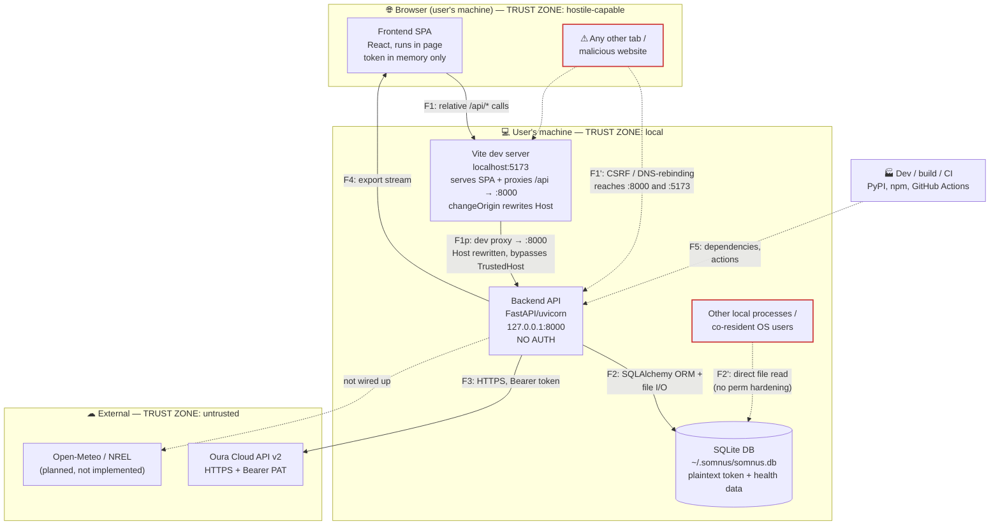

# Somnus — Threat Model

> **Status: APPROVED — authoritative.** Reviewed and approved by Kristov on 2026-07-05
> (PLAN.md Step 9.2). This document now governs how Somnus is built and reviewed; per the
> currency rule below it must never lag the code. Methodology and scope choices are recorded
> in [ADR 013](adr/013-threat-model-methodology.md).

- **Version:** 1.0 · **Authored:** 2026-07-05 · **Approved:** 2026-07-05 (Step 9.2) · **Method:** STRIDE-per-element over the C4 decomposition in [ARCHITECTURE.md](../ARCHITECTURE.md)
- **Scope of code reviewed:** `backend/`, `frontend/`, `.github/workflows/`, `Makefile`, `alembic.ini` + `alembic/` (migrations) at `dev` @ `67d37f3`.
- **Currency rule:** this is a living document with the same status as ARCHITECTURE.md — it must never lag the code. Every PR carries a "Threat model impact" statement (PLAN.md Step 9.4); a missing or wrong statement blocks merge. `file:line` citations are anchored to the reviewed commit above and are re-verified at each audit and version bump (prefer symbol names where practical).

---

## 1. Purpose

Somnus is a **local-first, single-user** sleep optimization app. It holds some of the most sensitive personal data an application can: sexual activity (including adult-content usage), illness, alcohol and substance use, precise nightly schedules, coarse location, and an **Oura personal access token** that grants read access to the user's cloud-stored health record. There are no accounts, no server, and no telemetry — everything runs on the user's own machine.

That posture removes whole classes of threat (no multi-tenant isolation, no credential database to breach, no data in transit to a first-party cloud) and sharpens others: the app's entire value — and its entire risk — is one SQLite file and one API token sitting on a personal device, reachable through an **unauthenticated HTTP API on `localhost`** that a web browser on the same machine can be tricked into contacting.

This document enumerates what we defend against, what we deliberately do not, and — for every threat — whether it is mitigated, partially mitigated, accepted, or open (pending fix in the Step 9.3 audit).

---

## 2. Assets

Ranked by sensitivity. The first two dominate the model; almost every serious threat is a path to one of them.

| # | Asset | Where it lives | Why it matters |
|---|-------|----------------|----------------|
| A1 | **Health & behavioral data** — sleep, sexual activity, illness, alcohol/substance, supplements, meals, notes | SQLite DB (`daily_logs` + sub-entry tables, `sleep_records`) | Maximally sensitive; disclosure is irreversible and personally damaging |
| A2 | **Oura personal access token** | `user_settings.oura_token`, **plaintext** `Text` column (`backend/models.py:390`) | Bearer credential to Oura's cloud health API; theft = ongoing remote access to more health data than Somnus itself stores |
| A3 | **Data exports** | Generated on demand, streamed to the browser: raw SQLite dump (`/api/export/sqlite`), CSV zip, JSON (`backend/routers/export.py`) | Same data as A1/A2 (the SQLite dump *contains* the token), in portable, easily-mishandled form |
| A4 | **Coarse location** — zip code | `user_settings.zip_code` `String(10)` (`backend/models.py:398`) | Re-identification aid; lower sensitivity than A1 but still PII |
| A5 | **Analysis outputs** — correlations, regression, recommendations | Computed on demand from A1; not persisted | Reveal behavioral patterns even without raw data |
| A6 | **Local logs** | uvicorn access log (stdout); no app logging configured | Request lines only (paths + query, never bodies or token — see T‑16); low value |

---

## 3. System decomposition & trust boundaries

Elements are the C4 containers plus each data flow that crosses a trust boundary. The STRIDE matrix in §5 is built against exactly this decomposition.

**Boundaries, explicitly:**

- **B1 — Browser ↔ Backend (F1):** the crown-jewel boundary. An unauthenticated HTTP API on `127.0.0.1:8000`. The *legitimate* client is the SPA, which in dev is served by the **Vite dev server on `localhost:5173`** and reaches the API through Vite's `/api` **proxy** (`frontend/vite.config.ts` → target `:8000`, `changeOrigin: true`). This makes `:5173` a **second ingress** to the API (F1p); and because `changeOrigin` rewrites the `Host` header to `localhost:8000`, a backend Host check sees a valid Host for all proxied traffic — so protecting `:5173` is Vite's job (`server.allowedHosts`), not the backend's (see T‑01). The *threat* is any other browser context on the same machine (another tab, a malicious ad, a link the user clicked). CORS pins the readable origin to `http://localhost:5173` (`backend/main.py:33-39`, `backend/config.py:16`), but CORS governs *who may read responses*, not *who may reach the port* — see T‑01.
- **B2 — Backend ↔ SQLite (F2):** in-process SQLAlchemy plus the DB file on disk, including **Alembic migrations** (`alembic/`) that run DDL/DML directly against the DB on startup (auto-migration in `main.py`). The file is also reachable by **any other process or OS user** with filesystem access (F2′).
- **B3 — Backend ↔ Oura (F3):** the only live outbound integration. HTTPS, token in the `Authorization` header, TLS verification on (`backend/services/oura_client.py:45,112`).
- **B4 — Backend ↔ Filesystem/exports (F4):** export endpoints serialize A1–A4 and stream them to the browser (which typically writes them to `~/Downloads`).
- **B5 — Supply chain (F5):** PyPI + npm dependencies and GitHub Actions that run with repo access.
- **Not a live boundary:** Open-Meteo / NREL. `open_meteo_base_url` is defined but unused and **no weather/solar client exists in `backend/`** (only `oura_client.py` makes outbound calls). ARCHITECTURE.md marks these as planned (not implemented); they carry **no attack surface today** and are modeled as future work (see §7).

**Elements (the STRIDE matrix rows in §5):** the C4 containers — **E1** Frontend SPA, **E2** Backend API, **E3** SQLite DB — plus the boundary-crossing flows **F1–F5** above, plus two call-out rows the decomposition surfaces: the **Vite dev proxy** (`:5173`, F1p) and the **Test router** (`/api/test/*`, mounted only under `SOMNUS_TESTING=1`).

**Data shared with third parties by design** (the privacy view STRIDE folds into Information Disclosure, per ADR 013): Somnus is read-mostly toward the cloud.
- **Oura (B3, live):** Somnus sends the user's own PAT (authenticating them to their own Oura account) and the requested date ranges, and *pulls* sleep/readiness data — it writes nothing back. Oura learns only that the account is being synced and for which dates, i.e. data it already holds; **no Somnus-entered health/behavioral data (A1) is ever sent to Oura.**
- **Open-Meteo / NREL (planned):** when built, these would receive the user's coarse location (zip code, A4) and dates to fetch weather/solar data — a by-design disclosure of A4 to a third party that must be surfaced to the user and modeled here at that time (see §7).

---

## 4. Adversary model

### In scope

| Adversary | Capability assumed | Primary target |
|-----------|--------------------|----------------|
| **AD1 — Malicious website in the user's browser** | User visits an attacker page while Somnus is running; attacker can issue cross-origin requests and run DNS-rebinding | A1, A2, A3 via B1 |
| **AD2 — Co-resident user / local process** | A different OS account or a non-privileged process on the same machine; filesystem access under normal permissions | A1, A2 via B2 (the DB file) |
| **AD3 — Compromised dependency or CI action** | Malicious code in a PyPI/npm package or a GitHub Action | Everything, at build/run time, via B5 |
| **AD4 — Malicious / compromised external API** | Oura (or a MITM / redirected base URL) returns hostile data | Data integrity (A1), and the free-text→HTML sink (T‑04) via B3 |
| **AD5 — Device theft / loss** | Physical possession of an unlocked-at-rest disk | A1, A2, A3, A4 at rest |

### Out of scope (with rationale)

- **Root / administrator compromise of the user's machine.** An attacker who is root can read process memory, keylog, and read any file regardless of permissions. No application-layer control survives this; defending it is the OS's job.
- **Compromise of Oura's cloud itself.** Outside our control; the token grants only the access Oura already grants the user.
- **Network eavesdropping on outbound calls.** Mitigated structurally by TLS with certificate verification (default httpx, no `verify=False`); we do not model a CA compromise.
- **Malicious first party.** The developer/operator and the single user are the same trust principal; we do not model the user attacking their own data (with one exception noted at T‑04/T‑12, where *external* data can reach a self-targeting sink).
- **Denial of service against the localhost API.** A single-user app the owner can restart at will; availability is not a security property here (see the DoS row in §5).
- **Multi-user access control / repudiation.** There is one user and no accounts; there are no privilege levels to separate and no third party to be accountable to (see the Repudiation row in §5).

---

## 5. STRIDE-per-element matrix

Every cell is populated with a threat ID or marked **n/a** with a reason. Empty cells are not permitted — that is the property that makes omissions visible.

| Element | Spoofing | Tampering | Repudiation | Info disclosure | DoS | Elevation |
|---------|----------|-----------|-------------|-----------------|-----|-----------|
| **F1 Browser↔Backend** | **T‑01** (rebinding defeats origin) | **T‑02** (CSRF write via GET) | n/a — single user, no accounts | **T‑03** (unauth read / bulk exfil) | out of scope — owner restarts; not a security property (§4) | **T‑04** (XSS in SPA origin → full API via proxy) |
| **E2 Backend API** | n/a — no identities to spoof | **T‑05** (unhandled 500 on update path) | n/a — see F1 | **T‑06** (`/docs`, OpenAPI exposed) | out of scope — local, single user (§4) | ✓ clean — no `eval`/`exec`/`pickle`/`subprocess` (verified) |
| **E3 SQLite DB** | n/a — file, not a principal | **T‑09** (FK not enforced → integrity) | n/a | **T‑07** (plaintext at rest) · **T‑08** (file perms) | n/a — local file | n/a — no in-DB privilege model |
| **F3 Backend↔Oura** | **T‑11** (base-URL override redirects token) | **T‑10** (blind trust of response shape/range) | n/a | ✓ TLS verified, token in header not URL (verified) | out of scope — user-initiated; 30s timeout, 50-page cap (§4) | n/a |
| **F4 Exports** | n/a | **T‑12** (CSV formula injection) · **T‑17** (torn export copy) | n/a | folds into **T‑03/T‑07** (dump contains token) | n/a | n/a |
| **E1 Frontend SPA** | n/a — no client identity | ✓ SPA code: no `dangerouslySetInnerHTML`/`eval` — T‑04's server-rendered report formerly executed in this origin via the `:5173` proxy (now Mitigated: escaped + CSP `sandbox` opaque origin) | n/a | ✓ token in memory only, not in web storage (verified) | n/a | **T‑14** (no CSP — defense-in-depth gap) |
| **F5 Supply chain** | **T‑13** (malicious dep/action) | folds into T‑13 | n/a | folds into T‑13 | n/a | folds into T‑13 |
| **Vite dev proxy (:5173)** | folds into **T‑01** (Host rewrite defeats backend check) | folds into **T‑02** (same CSRF surface via `:5173`) | n/a | folds into **T‑03** (proxied reads) | n/a — dev-only | **T‑04** (report renders here) · **T‑14** (no CSP) |
| **Test router** | n/a — no identity (unauth, like all endpoints) | **T‑15** (unauth DB-wipe when `SOMNUS_TESTING=1`) | n/a | n/a — returns only an ack | n/a — not mounted in normal runs | n/a — no privilege model |

Cross-cutting: **T‑16** (logging discipline) is a standing control, verified clean, that keeps the Info-disclosure row of E2/E3 from regressing.

---

## 6. Threat register

Status legend: **Mitigated** (control in place, cited) · **Partial** (control reduces but does not close) · **Accepted** (residual risk Kristov signs off on) · **Open** (no adequate control yet → must become a fix or an explicit acceptance in the Step 9.3 audit).

### T‑01 — DNS rebinding / CSRF against the localhost API — **Mitigated** — *Critical*
`backend/main.py` (`TrustedHostMiddleware`); `backend/config.py` (`allowed_hosts`); `frontend/vite.config.ts` (`server.allowedHosts`)

**STRIDE:** Spoofing / Elevation. **Adversary:** AD1.

CORS pins the *readable* origin to `http://localhost:5173`, which stops an ordinary cross-origin site from **reading** API responses. It does **not** stop a browser from **reaching** `127.0.0.1:8000`, and it is fully bypassed by DNS rebinding: the attacker serves a page from a host they control, then rebinds that hostname's DNS to `127.0.0.1`. The page's requests to `http://attacker-host:8000/…` are now **same-origin** with the rebound host, so CORS does not apply at all, and the page reads every response. Without a Host check, a website the user merely visits could read all health data, exfiltrate the SQLite dump **including the plaintext token** (T‑03), tamper with settings, and — if test mode is on — wipe the DB (T‑15); PLAN.md:782-783 names this adversary as in-scope. **This is now blocked:** `TrustedHostMiddleware` rejects any request whose `Host` is not `localhost`/`127.0.0.1` (400), and the `:5173` dev-proxy ingress (F1p) is refused by Vite's built-in host filter (a rebound `attacker.com` is neither an IP literal nor `localhost`/`*.localhost`, so Vite blocks it before `changeOrigin` can rewrite the Host past the backend check).

**Mitigation (implemented):** `TrustedHostMiddleware` with `allowed_hosts = ["localhost", "127.0.0.1"]` (`main.py` + `config.py`), added as the outermost middleware so bad hosts are rejected first; the port is ignored when matching. `SOMNUS_ALLOWED_HOSTS` overrides it (comma-separated **or** JSON list). The `:5173` dev-proxy path (F1p) is closed by **Vite's built-in host filter**, *not* by `server.allowedHosts` — that array's loopback entries are redundant with the built-ins (Vite short-circuits IP literals and `localhost`); its real job here is to additionally permit the Codespaces forwarded host. In a Codespace, the forwarded hosts (`<name>-8000/-5173.<domain>`) are auto-appended to both allow-lists (`codespaces_hosts()`); empty in production. Verified by `backend/tests/test_host_validation.py` (loopback + port accepted; non-loopback → 400).

**Residuals:** (a) *reachability* only — no per-request auth is added (T‑03, Accepted), and state-changing endpoints reachable via CORS-simple requests are not made idempotent (T‑02, Open), **including the `POST … copy-from` write**. (b) The F1p closure is **dev-server-scoped**; a packaged build must serve the SPA same-origin with the API (no Host-rewriting proxy) or re-close F1p, else it reopens while T‑01 reads Mitigated. (c) Running Vite with `--host` / a non-loopback `server.host` exposes the `/api` proxy to the LAN (IP-literal Hosts pass Vite's filter and `changeOrigin` launders them past the backend check) — don't use it with real data. (d) IPv6-literal binds (`[::1]`) are unsupported by the Host check (Starlette splits on `:`); the default `127.0.0.1` bind is unaffected. Optionally log a warning if a non-loopback Host is ever seen.

### T‑02 — CSRF via CORS-simple requests (state-changing GET + bodiless/form POST) — **Mitigated** — *High*
`backend/routers/oura.py` (`POST /api/oura/sync` + `require_json_content_type`); `recommender.py` (reads no longer commit; `complete_stale_experiments` on write); `settings.py` (`_settings_for_read`); `backend/routers/daily_log.py` (`copy-from` + `require_json_content_type`); `backend/security.py`

**STRIDE:** Tampering. **Adversary:** AD1.

Several **GET** endpoints mutate state, so a "simple" cross-origin GET — *sent* by the browser without a preflight even when CORS blocks *reading* the response — triggers the side effect with no rebinding required: `GET /api/oura/sync` upserts `SleepRecord`s, sets `last_oura_sync`, and spends the token against Oura (`oura.py:117-136`); `GET /api/recommendations` and `GET /api/experiments[/{id}]` auto-complete experiments and `db.commit()` (`recommender.py:345,414,429`); `GET /api/settings` creates and commits the singleton settings row (`settings.py:47-52`). (So experiment-lifecycle state *is* persisted on read — narrower than asset A5's "not persisted".) JSON-body writes (`PATCH /api/settings`, `PUT /api/daily-log`) are better protected — but **not** by content-type: `PATCH`/`PUT` are **non-simple methods**, so the browser always preflights them and the pinned origin fails the preflight. They still become writable under T‑01 rebinding. **Also in scope: bodiless / form-encoded `POST`s** are likewise CORS-simple (sent without preflight). `POST /api/daily-log/{date}/copy-from/{source_date}` takes no JSON body, so a cross-site form POST reaches it — reproduced live: **200, and the target day was destructively overwritten** with the source day. T‑01's Host check does not stop this (`Host: localhost:8000` is allowed); FastAPI's JSON content-type gate still blocks *injecting* attacker data (422), so the impact is integrity tampering of the user's own days, not exfiltration or injection.

**Mitigation (implemented):** two complementary fixes.
- **Reads made idempotent** (no commit on GET): `GET /api/settings` returns transient defaults via `_settings_for_read` instead of committing a row (`_get_or_create_settings` is now write-path-only); experiment auto-complete no longer fires on `GET /api/recommendations`/`/experiments` — `_build_experiment_out` computes the *displayed* COMPLETED status without persisting, and `complete_stale_experiments` writes it on the create (write) path so the single-active invariant holds.
- **Bodiless state-changers made non-simple:** `require_json_content_type` (`backend/security.py`) rejects any request whose `Content-Type` isn't `application/json` (415). `application/json` is not a CORS-simple content type, so a cross-site caller can only set it by triggering a preflight the pinned origin fails. Applied to `POST …/copy-from/…` (the reproduced destructive CSRF) and to Oura sync, which is **converted `GET`→`POST`** (a state-changer that spends the token). Endpoints that already require a JSON body are covered by FastAPI's body parsing (non-JSON → 422). The SPA's fetch client always sends `application/json`, so no legitimate call breaks. Combined with T‑01's Host validation (the durable cross-origin control) and T‑01's F1p closure, the CSRF surface is closed. Regression tests cover the 415 on non-JSON `copy-from`/sync, the removed sync GET (405), and GET-does-not-persist for settings.

### T‑03 — Unauthenticated read & bulk exfiltration — **Accepted** (design) — *High*
`backend/routers/export.py:239` (`/api/export/sqlite`), `:25` (`/api/export`); all read endpoints

**STRIDE:** Information disclosure. **Adversary:** AD1.

No endpoint requires authentication (verified: no `Security`/`Depends(auth)` anywhere). `GET /api/export/sqlite` streams the entire DB file — health data **and** the plaintext token — in one request; `GET /api/export?format=csv|json` and `/api/dashboard` expose the same data. The absence of per-request auth is an **accepted design choice** for a single-user local app — but **no ADR records it yet; a dedicated ADR is recommended as part of 9.2/9.3** (ADR 009 covers Oura PAT auth, not this decision). The acceptance is *conditional*: it is safe only once T‑01 confines reachability to loopback. **T‑01 has now landed (`TrustedHostMiddleware` + Vite `allowedHosts`), so DNS-rebinding reads are blocked and ordinary cross-origin reads are stopped by CORS — the acceptance now holds.**

**Mitigation:** primarily T‑01 (Host validation confines reachability to loopback). Residual after T‑01 — a co-resident user connecting directly to `127.0.0.1:8000` — is tracked as AD2/T‑08 and accepted for the local-first model. No per-request auth is planned; revisit if Somnus ever grows a remote/multi-device mode.

### T‑04 — Stored HTML/JS injection in the monthly HTML report — **Mitigated** — *High*
`backend/services/report_service.py` (`_esc` at every non-numeric interpolation); served with CSP by `backend/routers/reports.py` (`_html_report_response`)

**STRIDE:** Elevation (script execution in the SPA origin, via the dev proxy) / Tampering. **Adversary:** AD1 chained, AD4.

`render_monthly_html` interpolates user-controlled free text — `exp.get("hypothesis", "")` (unbounded, `schemas.py:623`) and `factor_label`, which falls back to the raw `experiment.factor` (`recommender.py:385`) — directly into a `text/html` response with **no escaping** (Python f-strings, no autoescape). The report is served `Content-Disposition: inline` (`reports.py:55,68`) and opened from a **relative** `/api/reports/...` URL (`frontend/src/api/reports.ts:33,41`) via `target="_blank"`, so in the dev flow it is fetched **through the Vite proxy and renders at the SPA origin `http://localhost:5173`** — same-origin with the SPA and, through the proxy, with every `/api` endpoint. Any injected `<script>`/`` therefore runs with full access to the unauthenticated API (exfiltrate A1/A2, wipe data) and to SPA state. The planting vector is normally the user's own text (self-XSS, low value), but it becomes an attacker path when chained with T‑01/T‑02 (a rebound page POSTs a malicious `hypothesis`, the user later exports the month) or when hostile external data reaches a report field (AD4). The weekly report and the fixed contributing-factor labels use only numbers/enum strings and are not affected.

**Mitigation (implemented):** all non-numeric interpolations in `render_weekly_html`/`render_monthly_html` (and helpers) go through stdlib `html.escape` via `_esc` — the invariant is documented on `_esc` itself: every f-string hole that is not a numeric format spec must be escaped. Input validation at the API boundary: `ExperimentCreate.hypothesis` is length-bounded (500), and `ExperimentCreate.factor` is validated against the known analyzable-variable keys (`VARIABLE_LABELS`), eliminating the untrusted raw-`factor` label path entirely. Defense-in-depth: both `export-html` endpoints send `Content-Security-Policy: default-src 'none'; style-src 'unsafe-inline'; base-uri 'none'; form-action 'none'; frame-ancestors 'none'; sandbox` plus `X-Content-Type-Options: nosniff` — the `sandbox` directive renders the report in an opaque origin with scripts blocked, so even a future missed escape cannot reach the API through the proxy, and `frame-ancestors 'none'` (which does **not** fall back to `default-src`) blocks hostile pages from iframing the health report (UI redress). Regression tests cover escaping (unit + end-to-end through a stored hypothesis), the headers, the length bound, and factor validation. The SPA's own CSP remains T‑14 (open, defense-in-depth).

### T‑05 — Unhandled exception on the entry-update path — **Mitigated** — *Low*
`backend/routers/daily_log.py` (`update_entry` now wraps validation → 422, matching `add_entry`)

**STRIDE:** Tampering / minor info disclosure. `update_entry` passed `data: dict` to `schema_cls(**data)` without catching `ValidationError`, so bad input yielded an unhandled **500** instead of the 422 the add path returns. Debug is off (`main.py:26-31`), so **no traceback leaks** to the client — impact was a confusing error and inconsistent API behavior, not disclosure.

**Mitigation (implemented):** `update_entry` and `add_entry` catch **`pydantic.ValidationError` only** → 422 (a client-input error); the not-found (`None`) result still returns 404. A DB `IntegrityError` — reachable from a client body since T‑09 enforces the `red_light_entries.panel_id` FK — maps to a clean **409 without echoing `str(exc)`** (a broad `except Exception → 422 str(exc)` would echo the failed SQL statement and bound parameters into the response body). Other faults propagate to FastAPI's generic 500, which carries no detail. Regression tests assert a below-minimum body returns 422 and an unknown `panel_id` returns 409 with no SQL text in the body.

### T‑06 — API docs & schema exposed — **Accepted** — *Low*
`backend/main.py:26-31` (defaults not overridden)

**STRIDE:** Information disclosure. `/docs`, `/redoc`, `/openapi.json` are served. They reveal the API shape but no data. For a local single-user app this is a convenience, not a leak; anyone who can reach the docs can already reach the data endpoints (T‑01/T‑03 are the real issues).

**Acceptance rationale:** shape disclosure adds nothing an attacker with port access lacks. Optionally disable in a future packaged build; not required.

### T‑07 — Plaintext sensitive data at rest — **Accepted** (with documented residual + user guidance) — *High (device theft) / Medium (co-resident)*
`backend/models.py:390` (token, plaintext `Text`); DB at `backend/config.py:15`

**STRIDE:** Information disclosure. **Adversary:** AD5, AD2. The DB stores the Oura token and all health data unencrypted. On a lost/stolen device with an unencrypted disk, or to a co-resident user (T‑08), everything is readable.

**Mitigation:** Somnus is designed for a **user-supplied DB path** (`SOMNUS_DB_PATH`, `config.py:20`) so the file can live on an encrypted volume; onboarding deliberately orders the *Data Storage* step **before** the *Oura* step. As of the T‑07 disposition that step carries a prominent, non-dismissible security notice that (a) states plainly the DB is unencrypted and names the sensitive assets at risk, (b) recommends **full-disk encryption** as the baseline (FileVault / BitLocker / LUKS), and (c) recommends an **additional encrypted volume such as VeraCrypt** with the `SOMNUS_DB_PATH` relocation steps (`DataStorageStep.tsx`). The same guidance is in `README.md` (§ *Encryption at rest*). This pushes encryption-at-rest to the OS/volume layer, where it belongs for a local-first app.

**Disposition — Accepted for v0.1 (Kristov, 2026‑07‑06).** Application-level encryption is **not** implemented for v0.1: without a real key store it only relocates the plaintext, and the device-theft vector is only genuinely closed by full-disk encryption regardless. The acceptance is conditioned on the loud, specific user guidance above. **Scope of the accepted residual as the code stands today:** (1) a user who declines both full-disk encryption and an encrypted volume on their own machine, *and* (2) the co-resident / other-OS-user read of the default `~/.somnus/somnus.db` — because **T‑08 (file-permission hardening) is still Open**, the DB is created under the process umask with no `chmod`, so this path is **not yet closed**. T‑08's `0600`/`0700` fix (a separate, still-open 9.3 item — not a prerequisite for this acceptance) will *narrow* residual (2) to same-user processes when it lands; until then the co-resident exposure is real and accepted alongside (1). Revisit if Somnus grows a multi-device/remote mode or a first-class key store; a future app-level-encryption ADR (OS keychain or user passphrase) remains the candidate escalation.

### T‑08 — DB file has no permission hardening — **Mitigated** — *Medium*
`backend/database.py` (`_harden_db_permissions`, called by `init_db`)

**STRIDE:** Information disclosure. **Adversary:** AD2. `init_db` creates `~/.somnus/` and the DB file under the process's default umask; on a multi-user machine with a permissive umask, other local users may read the token and health data directly (bypassing all API controls).

**Mitigation (implemented):** `init_db` now calls `_harden_db_permissions`, which `chmod`s the DB file to `0600` after `create_all` (owner-only, umask-independent) **wherever the file lives**, and hardens the parent directory to `0700` **only when it is the app-managed default `~/.somnus`** — a user-supplied `SOMNUS_DB_PATH` (the T‑07 encrypted-volume flow) may point into a directory other users or tools legitimately share (or `.` for a relative path), which Somnus must not lock to owner-only. The file and directory chmods are independent best-effort steps, so a failed/skipped directory attempt can never skip the file hardening. `:memory:` and non-POSIX platforms are skipped (the T‑07 OS-layer encryption guidance is the primary control there). This closes the **other-OS-user** read path; it does **not** stop a process running as the *same* user (which AD2 also names) — a same-user process reads a `0600` file, and that residual is inherent to the local-first model (a same-user process is inside the user's trust domain), accepted rather than closed. This also narrows the co-resident sub-path of the accepted **T‑07** residual. Regression tests assert the `0700`/`0600` bits at the default location, file-only hardening at a custom path, the file chmod surviving a failed directory chmod, and the `:memory:` no-op.

### T‑09 — SQLite foreign keys not enforced — **Mitigated** — *Low*
`backend/database.py` (`_enable_sqlite_foreign_keys`, `@event.listens_for(Engine, "connect")`)

**STRIDE:** Tampering (integrity). `ForeignKey`/cascade constraints are declared in `models.py` but SQLite ignores FKs unless `PRAGMA foreign_keys=ON` is set per-connection, which it is not. Orphaned rows / failed cascades are possible, corrupting analysis inputs. Not a confidentiality issue.

**Mitigation (implemented):** a `connect` event listener registered on the base SQLAlchemy `Engine` runs `PRAGMA foreign_keys=ON` on every new SQLite connection (app engine and test engines alike), so declared FK/cascade constraints are enforced. Regression tests assert an orphaned child row is rejected and a parented one is accepted.

### T‑10 — Blind trust of external API response — **Partial** — *Medium*
`backend/services/oura_client.py:160` (`fromisoformat` on response), `oura.py:119`

**STRIDE:** Tampering. **Adversary:** AD4. Oura responses are parsed into ORM models; shape is constrained by the mapping but **semantic ranges are not necessarily validated**, so a compromised/MITM'd Oura response (or a redirected base URL, T‑11) could inject implausible values into A1, skewing analysis, and text fields could feed the T‑04 sink.

**Existing mitigation (Partial):** TLS with cert verification, 30s timeout, 50-page pagination cap (`oura_client.py:112,37`); structured parsing rejects malformed types.

**Recommended:** validate numeric ranges on ingested Oura fields; ensure T‑04's output-escaping neutralizes any hostile text regardless of source.

### T‑11 — Outbound base-URL override redirects the token — **Accepted** — *Low*
`backend/config.py:17` (`SOMNUS_OURA_API_BASE_URL`, env-overridable)

**STRIDE:** Spoofing / info disclosure. Setting `SOMNUS_OURA_API_BASE_URL` to an attacker host (or an `http://` URL) would send the `Authorization: Bearer` token there. Requires the ability to set the app's environment — i.e. local control that already implies broader compromise.

**Acceptance rationale:** env-setting capability is out-of-scope-adjacent (AD out-of-scope: local env control ≈ machine control). Optionally assert `https://` scheme on the base URL as cheap hardening.

### T‑12 — CSV export formula injection — **Mitigated** — *Medium*
`backend/routers/export.py` (`_neutralize_csv_cell`, applied in `_to_csv`)

**STRIDE:** Tampering / (downstream) code execution in the user's spreadsheet. **Adversary:** AD1-chained, AD4, or self. CSV cells were written verbatim; a value beginning `=`, `+`, `-`, `@`, tab, CR, or LF (reachable via free-text `notes`, supplement `name`, habit `value`) becomes an active formula when the export is opened in Excel/Sheets. Higher risk if hostile text was written via T‑01/T‑02 or arrived from Oura (AD4).

**Mitigation (implemented):** `_to_csv` now runs every data cell through `_neutralize_csv_cell`, which prefixes a leading `=`/`+`/`-`/`@`/tab/CR/LF (the OWASP CSV-injection trigger set) with a single quote so spreadsheet apps treat it as literal text. The export has no negative-number columns, so guarding `-` mangles no legitimate value. Regression tests assert `=HYPERLINK`/`@SUM`/LF-prefixed payloads are quoted (data preserved, formula inert) and that safe values are untouched.

### T‑13 — Supply-chain compromise — **Partial** — *Medium*
`.github/workflows/ci.yml`; `pyproject.toml`; `frontend/package.json`

**STRIDE:** all. **Adversary:** AD3. A malicious PyPI/npm package or GitHub Action runs with build/run privileges.

**Existing mitigation (Partial):** CI runs `pip-audit` and `bandit` on the backend and `gitleaks` secret-scanning (`ci.yml:46-50,88-100`); ruff enables the `S` (bandit) and `T20` (print) rule sets; the frontend has only **three** runtime deps (`react`, `react-dom`, `react-router-dom`); the frontend lockfile (`package-lock.json`) is committed and installed with `npm ci`. 

**Gaps (remaining Open sub-items):** **The backend has no committed lockfile** — `pyproject.toml` uses floating `>=` ranges, so installs resolve unpinned (the cooldown below bounds *how new* a version may be, not *which exact* one). Enforcing a `uv.lock` requires switching the backend install/run flow (`uv sync` + venv, or a compiled requirements lock consumed by `uv pip install -r`), which touches every backend CI step — deferred to a focused follow-up so the required backend legs are validated in isolation. *(Done: `npm audit --omit=dev --audit-level=high` now runs in CI; GitHub Actions are SHA-pinned.)*

**Implemented — install cooldown (ADR 014):** a ~7-day minimum release age now gates installs in both ecosystems, so a freshly-published (publish-then-yank) malicious release is not pulled: `min-release-age=7` (days) in `frontend/.npmrc`, and `[tool.uv.pip] exclude-newer = "7 days"` committed in `pyproject.toml` so every `uv pip install` in the repo is gated (the install recipe lives once, in `make setup-backend`, which CI runs). The npm ≥ 11.10 floor is enforced at lockfile-update time via `engines` + `engine-strict` (older npm silently ignores the key), and the gating tools themselves are version-pinned (`uv==` in the Makefile, exact `npm@` in CI) so they cannot be hit by the same vector. Security fixes inside the window stay pullable via the override path (`UV_EXCLUDE_NEWER="0 days"` beats the committed config, or `exclude-newer-package`). **CI now runs `npm audit --package-lock-only --omit=dev --audit-level=high` *before* `npm ci`** on the frontend (audit-before-install: the committed lockfile is evaluated before any dependency lifecycle script executes; production deps are what ship to the browser; the react-router-dom line was upgraded to 7.18.1 to clear its high/critical advisories), and **all GitHub Actions are pinned to commit SHAs** (with a `# vX.Y.Z` comment). **Remaining:** commit + enforce a backend lockfile (`uv.lock`) — deferred to a follow-up (needs the `uv sync`/compiled-lock flow change validated against the backend CI legs). Socket's PR alerts remain as malware detection. (Matches the CLAUDE.md/MEMORY rule: audit deps before install.)

### T‑14 — No Content-Security-Policy — **Mitigated** — *Low*
`frontend/vite.config.ts` (`spaCspPlugin`, build-only `<meta>`); report responses via `backend/routers/reports.py` (T‑04)

**STRIDE:** Elevation (defense-in-depth for XSS). No CSP meant the T‑04 injection (and any future DOM-XSS) faced no second line of defense. The SPA loads only local assets and makes only same-origin `/api` calls (verified — no CDNs, fonts, or analytics), so a strict CSP is low-friction.

**Mitigation (implemented):** `spaCspPlugin` injects a `<meta http-equiv="Content-Security-Policy">` **prepended to `<head>`** of the **production** `index.html` (`default-src 'self'; script-src 'self'; style-src 'self' 'unsafe-inline'; img-src 'self' data:; connect-src 'self'; object-src 'none'; base-uri 'self'; form-action 'self'`) — prepended because a meta CSP only governs fetches parsed after it, so it must precede the entry script/stylesheet tags. It is build-only (`apply: 'build'`) so Vite's dev HMR (ws + eval) is untouched; `'unsafe-inline'` in `style-src` is required by the UI's React inline `style={{}}`. The policy deliberately omits `frame-ancestors`: browsers **ignore** that directive (like `sandbox`/`report-uri`) when the policy is delivered via a `<meta>` element, so including it would only misstate the protection. The report-export responses already carry an origin-isolating CSP **as real response headers**, including an effective `frame-ancestors 'none'` (T‑04, `_html_report_response`). Verified in the built `dist/index.html`. **Residuals:** (a) the statically-served SPA currently has **no anti-framing protection** — `frame-ancestors` / `X-Frame-Options` only work as response headers, so whatever serves `dist/` in a packaged build must add one (tracked with the T‑01 packaged-build residual; low impact today: framing a localhost SPA achieves UI redress only, and the sensitive HTML reports are separately protected); (b) in a future packaged build where the SPA and API are on different origins, `connect-src` must be revisited.

### T‑15 — Unauthenticated DB-wipe test endpoint — **Accepted** — *Low (normal) / High (if enabled)*
`backend/routers/testing.py:11-17`; gated at `backend/main.py:51-54`

**STRIDE:** Tampering (destruction). `POST /api/test/reset` drops and recreates every table with no in-handler guard. It is mounted **only** when `SOMNUS_TESTING=1`, which `make dev` never sets (`Makefile:16-17`) — so it is **absent in normal runs** (used only by Playwright, `playwright.config.ts:22`). If ever enabled in a reachable deployment, it becomes an unauthenticated data-destruction endpoint, and combines with T‑01 (a website could wipe the DB).

**Acceptance rationale:** not mounted in any user-facing path; gating is a single, auditable env check. **Guard recommended:** additionally refuse if the DB path is not a temp/test path, so an accidental `SOMNUS_TESTING=1` on a real DB cannot wipe it.

### T‑16 — Logging discipline (standing control) — **Mitigated** — *n/a*
`backend/` (no `logging.basicConfig`; module loggers declared but never invoked)

**STRIDE:** Information disclosure (preventive). Verified: **no log call sites and no `print`** in non-test backend; the token and health data never reach logs; `flake8-print` (`T20`) in CI would fail a stray `print`. uvicorn access logs record request lines only — dates/format in query strings, never the token or bodies (`oura.py:40`, `export.py:26`). This is the control that keeps the E2/E3 info-disclosure rows closed; **any PR that adds logging must preserve it** (see checklist §8).

### T‑17 — SQLite export may capture a torn / inconsistent copy — **Mitigated** — *Low*
`backend/routers/export.py` (`_consistent_sqlite_snapshot`, `GET /api/export/sqlite`)

**STRIDE:** Tampering (integrity of A3). **Adversary:** self / concurrent write. The endpoint byte-copied the *live* DB file (`open(db_path, "rb")` + `shutil.copyfileobj`) with no SQLite backup API, no lock, and no `-wal`/`-journal` handling. If a write was in flight (e.g. an Oura sync upserting `SleepRecord`s) the streamed copy could capture a torn page set or miss journal state, yielding a `.db` that fails `PRAGMA integrity_check` or silently drops the in-flight transaction — and the user relies on this export as their backup of otherwise-unrecoverable data.

**Mitigation (implemented):** `_consistent_sqlite_snapshot` uses SQLite's online backup API (`sqlite3.Connection.backup` into an in-memory DB, then `serialize()`), which copies pages under a read transaction, so the snapshot is internally consistent even under concurrent writes. Regression test creates a DB, snapshots it, and asserts the bytes are a valid SQLite file that passes `PRAGMA integrity_check` with data intact.

---

## 7. Residual & accepted risks (summary)

| ID | Residual after mitigation | Disposition |
|----|---------------------------|-------------|
| T‑01 | F1p closure is dev-server-scoped (a packaged-build proxy could reopen it); `--host` exposes `/api` to the LAN; IPv6-literal binds unsupported | Documented residual — re-close F1p same-origin in any packaged build |
| T‑03 | Co-resident user connecting directly to `127.0.0.1:8000` after T‑01 | Accepted (local-first model); revisit if remote mode is added |
| T‑06 | API shape visible via `/docs` | Accepted |
| T‑07 | Secrets in clear if user declines full-disk encryption *and* an encrypted volume | Accepted for v0.1 (Kristov, 2026‑07‑06), conditioned on loud onboarding + README guidance (full-disk encryption baseline + VeraCrypt-style volume); the co-resident sub-path is now narrowed by the T‑08 file-perm hardening (`0600`/`0700`); app-level-encryption ADR is the candidate escalation |
| T‑08 | Same-user processes read the `0600` file; a custom `SOMNUS_DB_PATH` parent directory keeps its user-managed permissions (the file itself is still `0600`) | Accepted (a same-user process is inside the local-first trust domain; a shared custom directory is the user's deliberate choice per the T‑07 guidance) |
| T‑11 | Token misdirected if the app env is attacker-controlled | Accepted (implies machine control) |
| T‑13 | Backend installs resolve unpinned (no committed `uv.lock`); cooldown + audits bound the exposure | Documented residual — lockfile enforcement deferred to a focused follow-up |
| T‑14 | The statically-served SPA has no anti-framing protection (`frame-ancestors` is header-only; a meta CSP can't carry it) | Documented residual — the packaged build's static server must send a CSP header or `X-Frame-Options`; reports are separately protected (T‑04 headers) |
| T‑15 | Destructive endpoint if `SOMNUS_TESTING=1` is set on a real DB | Accepted + path-guard recommended |
| Open-Meteo/NREL | No surface today (unimplemented) | Deferred — **when implemented, add F-flows, model SSRF/base-URL/response-trust (mirror T‑10/T‑11), and update this doc in the same PR** |

**Step 9.3 audit status:** T‑02, T‑04, T‑05, T‑08, T‑09, T‑12, T‑14, and T‑17 are **Mitigated** (fix PRs citing their threat IDs); T‑01/T‑03/T‑06/T‑07/T‑11/T‑15 carry documented acceptances above. The one remaining open sub-item is the **T‑13 backend lockfile** (`uv.lock`), deferred to a focused follow-up because it changes the backend install flow CI depends on; npm audit-before-install in CI, Action SHA-pinning, and the install cooldown (ADR 014) are done.

---

## 8. Baking into the workflow (standing practice — wired 2026-07-09)

Step 9.4 is complete: the following is standing practice, reflected in CLAUDE.md ("Threat Model" rule) and the PLAN.md Security Review Process checklist:

- **Every PR** includes a **"Threat model impact"** section: `None` + one-line justification, or a summary of what changed with `docs/THREAT_MODEL.md` updated in the same PR. Review verifies the statement against the diff; a missing or wrong one blocks merge.
- **When touching a boundary**, name it (B1–B5) and the threats (T‑nn) affected.
- **Standing invariants** (regression-guard checklist): no new unauthenticated network reachability without Host validation (T‑01); no user/external text into an HTML/CSV sink without escaping/neutralization (T‑04, T‑12); no secret or health data into logs (T‑16); no new dependency without an audit (T‑13); DB-path and token handling changes get extra scrutiny (T‑07, T‑08).

---

## 9. References

- [ADR 013 — Threat Model Methodology and Scope](adr/013-threat-model-methodology.md)
- [ARCHITECTURE.md](../ARCHITECTURE.md) — C4 decomposition this model is built against
- [ADR 003 — Missing Data Semantics](adr/003-missing-data-semantics.md), [ADR 009 — Oura Sync Architecture](adr/009-oura-sync-architecture.md)
- PLAN.md Step 9 (gate definition) and "Security Review Process"
