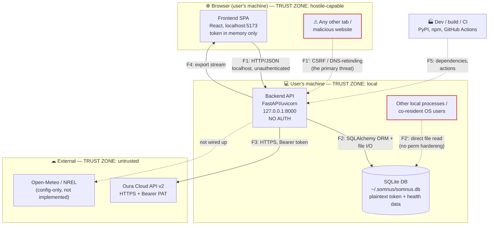

# Somnus — Threat Model

> **Status: DRAFT — not yet authoritative.** Per PLAN.md Step 9.2, this document
> governs how Somnus is built and reviewed only after Kristov reviews and approves it.
> Until then it is a proposal. Methodology and scope choices are recorded in
> [ADR 013](adr/013-threat-model-methodology.md).

- **Version:** 0.1 (draft) · **Authored:** 2026-07-05 · **Method:** STRIDE-per-element over the C4 decomposition in [ARCHITECTURE.md](../ARCHITECTURE.md)
- **Scope of code reviewed:** `backend/`, `frontend/`, `.github/workflows/`, `Makefile`, `alembic.ini` at `dev` @ `67d37f3`.
- **Currency rule:** this is a living document with the same status as ARCHITECTURE.md — it must never lag the code. Every PR carries a "Threat model impact" statement (PLAN.md Step 9.4); a missing or wrong statement blocks merge.

---

## 1. Purpose

Somnus is a **local-first, single-user** sleep optimization app. It holds some of the most sensitive personal data an application can: sexual activity (including adult-content usage), illness, alcohol and substance use, precise nightly schedules, coarse location, and an **Oura personal access token** that grants read access to the user's cloud-stored health record. There are no accounts, no server, and no telemetry — everything runs on the user's own machine.

That posture removes whole classes of threat (no multi-tenant isolation, no credential database to breach, no data in transit to a first-party cloud) and sharpens others: the app's entire value — and its entire risk — is one SQLite file and one API token sitting on a personal device, reachable through an **unauthenticated HTTP API on `localhost`** that a web browser on the same machine can be tricked into contacting.

This document enumerates what we defend against, what we deliberately do not, and — for every threat — whether it is mitigated, partially mitigated, accepted, or open (pending fix in the Step 9.3 audit).

---

## 2. Assets

Ranked by sensitivity. The first two dominate the model; almost every serious threat is a path to one of them.

| # | Asset | Where it lives | Why it matters |
|---|-------|----------------|----------------|
| A1 | **Health & behavioral data** — sleep, sexual activity, illness, alcohol/substance, supplements, meals, notes | SQLite DB (`daily_logs` + sub-entry tables, `sleep_records`) | Maximally sensitive; disclosure is irreversible and personally damaging |
| A2 | **Oura personal access token** | `user_settings.oura_token`, **plaintext** `Text` column (`backend/models.py:390`) | Bearer credential to Oura's cloud health API; theft = ongoing remote access to more health data than Somnus itself stores |
| A3 | **Data exports** | Generated on demand, streamed to the browser: raw SQLite dump (`/api/export/sqlite`), CSV zip, JSON (`backend/routers/export.py`) | Same data as A1/A2 (the SQLite dump *contains* the token), in portable, easily-mishandled form |
| A4 | **Coarse location** — zip code | `user_settings.zip_code` `String(10)` (`backend/models.py:398`) | Re-identification aid; lower sensitivity than A1 but still PII |
| A5 | **Analysis outputs** — correlations, regression, recommendations | Computed on demand from A1; not persisted | Reveal behavioral patterns even without raw data |
| A6 | **Local logs** | uvicorn access log (stdout); no app logging configured | Request lines only (paths + query, never bodies or token — see T‑16); low value |

---

## 3. System decomposition & trust boundaries

Elements are the C4 containers plus each data flow that crosses a trust boundary. The STRIDE matrix in §5 is built against exactly this decomposition.

**Boundaries, explicitly:**

- **B1 — Browser ↔ Backend (F1):** the crown-jewel boundary. An unauthenticated HTTP API on `127.0.0.1:8000`. The *legitimate* client is the SPA on `localhost:5173`; the *threat* is any other browser context on the same machine (another tab, a malicious ad, a link the user clicked). CORS pins the readable origin to `http://localhost:5173` (`backend/main.py:33-39`, `backend/config.py:16`), but CORS governs *who may read responses*, not *who may reach the port* — see T‑01.
- **B2 — Backend ↔ SQLite (F2):** in-process SQLAlchemy plus the DB file on disk. The file is also reachable by **any other process or OS user** with filesystem access (F2′).
- **B3 — Backend ↔ Oura (F3):** the only live outbound integration. HTTPS, token in the `Authorization` header, TLS verification on (`backend/services/oura_client.py:45,112`).
- **B4 — Backend ↔ Filesystem/exports (F4):** export endpoints serialize A1–A4 and stream them to the browser (which typically writes them to `~/Downloads`).
- **B5 — Supply chain (F5):** PyPI + npm dependencies and GitHub Actions that run with repo access.
- **Not a live boundary:** Open-Meteo / NREL. `open_meteo_base_url` is defined but unused and **no weather/solar client exists in `backend/`** (only `oura_client.py` makes outbound calls). ARCHITECTURE.md describes these as planned; they carry **no attack surface today** and are modeled as future work (see §7).

---

## 4. Adversary model

### In scope

| Adversary | Capability assumed | Primary target |
|-----------|--------------------|----------------|
| **AD1 — Malicious website in the user's browser** | User visits an attacker page while Somnus is running; attacker can issue cross-origin requests and run DNS-rebinding | A1, A2, A3 via B1 |
| **AD2 — Co-resident user / local process** | A different OS account or a non-privileged process on the same machine; filesystem access under normal permissions | A1, A2 via B2 (the DB file) |
| **AD3 — Compromised dependency or CI action** | Malicious code in a PyPI/npm package or a GitHub Action | Everything, at build/run time, via B5 |
| **AD4 — Malicious / compromised external API** | Oura (or a MITM / redirected base URL) returns hostile data | Data integrity (A1), and the free-text→HTML sink (T‑04) via B3 |
| **AD5 — Device theft / loss** | Physical possession of an unlocked-at-rest disk | A1, A2, A3, A4 at rest |

### Out of scope (with rationale)

- **Root / administrator compromise of the user's machine.** An attacker who is root can read process memory, keylog, and read any file regardless of permissions. No application-layer control survives this; defending it is the OS's job.
- **Compromise of Oura's cloud itself.** Outside our control; the token grants only the access Oura already grants the user.
- **Network eavesdropping on outbound calls.** Mitigated structurally by TLS with certificate verification (default httpx, no `verify=False`); we do not model a CA compromise.
- **Malicious first party.** The developer/operator and the single user are the same trust principal; we do not model the user attacking their own data (with one exception noted at T‑04/T‑12, where *external* data can reach a self-targeting sink).
- **Denial of service against the localhost API.** A single-user app the owner can restart at will; availability is not a security property here (see the DoS row in §5).
- **Multi-user access control / repudiation.** There is one user and no accounts; there are no privilege levels to separate and no third party to be accountable to (see the Repudiation row in §5).

---

## 5. STRIDE-per-element matrix

Every cell is populated with a threat ID or marked **n/a** with a reason. Empty cells are not permitted — that is the property that makes omissions visible.

| Element | Spoofing | Tampering | Repudiation | Info disclosure | DoS | Elevation |
|---------|----------|-----------|-------------|-----------------|-----|-----------|
| **F1 Browser↔Backend** | **T‑01** (rebinding defeats origin) | **T‑02** (CSRF write via GET) | n/a — single user, no accounts | **T‑03** (unauth read / bulk exfil) | n/a — owner restarts; not a security property | **T‑04** (XSS in API origin → full API) |
| **E2 Backend API** | n/a — no identities to spoof | **T‑05** (unhandled 500 on update path) | n/a — see F1 | **T‑06** (`/docs`, OpenAPI exposed) | accepted — local, single user | ✓ clean — no `eval`/`exec`/`pickle`/`subprocess` (verified) |
| **E3 SQLite DB** | n/a — file, not a principal | **T‑09** (FK not enforced → integrity) | n/a | **T‑07** (plaintext at rest) · **T‑08** (file perms) | n/a — local file | n/a — no in-DB privilege model |
| **F3 Backend↔Oura** | **T‑11** (base-URL override redirects token) | **T‑10** (blind trust of response shape/range) | n/a | ✓ TLS verified, token in header not URL (verified) | accepted — sync is user-initiated, 30s timeout, 50-page cap | n/a |
| **F4 Exports** | n/a | **T‑12** (CSV formula injection) | n/a | folds into **T‑03/T‑07** (dump contains token) | n/a | n/a |
| **E1 Frontend SPA** | n/a — no client identity | ✓ no `dangerouslySetInnerHTML`/`eval` (verified) | n/a | ✓ token in memory only, not in web storage (verified) | n/a | **T‑14** (no CSP — defense-in-depth gap) |
| **F5 Supply chain** | **T‑13** (malicious dep/action) | folds into T‑13 | n/a | folds into T‑13 | n/a | folds into T‑13 |
| **Test router** | — | **T‑15** (unauth DB-wipe when `SOMNUS_TESTING=1`) | n/a | — | — | — |

Cross-cutting: **T‑16** (logging discipline) is a standing control, verified clean, that keeps the Info-disclosure row of E2/E3 from regressing.

---

## 6. Threat register

Status legend: **Mitigated** (control in place, cited) · **Partial** (control reduces but does not close) · **Accepted** (residual risk Kristov signs off on) · **Open** (no adequate control yet → must become a fix or an explicit acceptance in the Step 9.3 audit).

### T‑01 — DNS rebinding / CSRF against the localhost API — **Open** — *Critical*
`backend/main.py` (no Host validation); `backend/config.py:16` (CORS)

**STRIDE:** Spoofing / Elevation. **Adversary:** AD1.

CORS pins the *readable* origin to `http://localhost:5173`, which stops an ordinary cross-origin site from **reading** API responses. It does **not** stop a browser from **reaching** `127.0.0.1:8000`, and it is fully bypassed by DNS rebinding: the attacker serves a page from a host they control, then rebinds that hostname's DNS to `127.0.0.1`. The page's requests to `http://attacker-host:8000/…` are now **same-origin** with the rebound host, so CORS does not apply at all, and the page reads every response. There is **no `TrustedHostMiddleware`** and no other Host-header check anywhere (`backend/main.py:33` registers only `CORSMiddleware`), so uvicorn accepts any `Host`. Result: a website the user merely visits can read all health data, exfiltrate the SQLite dump **including the plaintext token** (T‑03), tamper with settings, and — if test mode is on — wipe the DB (T‑15). PLAN.md:782-783 explicitly names this adversary as in-scope.

**Required mitigation (Step 9.3):** add `TrustedHostMiddleware` allowing only `localhost`/`127.0.0.1` (+ configured port); this single control also closes the *reachability* half of T‑02 and T‑03. Consider a startup log line if a non-loopback Host is ever seen.

### T‑02 — State-changing GET enables CSRF side effects — **Open** — *High*
`backend/routers/oura.py:38` (`GET /api/oura/sync`)

**STRIDE:** Tampering. **Adversary:** AD1.

`GET /api/oura/sync` mutates state (upserts `SleepRecord`s, sets `last_oura_sync`, spends the token against Oura — `oura.py:117-136`). A "simple" cross-origin GET is *sent* by the browser without a preflight even when CORS will block *reading* the response, so an attacker page can trigger a sync (and outbound token use) as a pure side effect, no rebinding required. JSON-body writes (`PATCH /api/settings`, `PUT /api/daily-log`) are better protected because their `application/json` content-type forces a CORS preflight that the pinned origin fails — but they become writable under T‑01 rebinding.

**Required mitigation:** make sync a `POST` (removing it from the simple-GET CSRF surface); T‑01's Host validation covers the rebinding path for all writes. A CSRF token is unnecessary once Host validation is in place and the state-changer is non-simple.

### T‑03 — Unauthenticated read & bulk exfiltration — **Partial** (design) / mitigated-by **T‑01** — *High*
`backend/routers/export.py:239` (`/api/export/sqlite`), `:25` (`/api/export`); all read endpoints

**STRIDE:** Information disclosure. **Adversary:** AD1.

No endpoint requires authentication (verified: no `Security`/`Depends(auth)` anywhere). `GET /api/export/sqlite` streams the entire DB file — health data **and** the plaintext token — in one request; `GET /api/export?format=csv|json` and `/api/dashboard` expose the same data. Absence of auth is an **accepted design choice** for a single-user local app (ADR 009), and is defensible *as long as the port is only reachable by the local user*. The real exposure is therefore the *reachability* gap in T‑01. 

**Mitigation:** primarily T‑01 (Host validation confines reachability to loopback). Residual after T‑01 — a co-resident user connecting directly to `127.0.0.1:8000` — is tracked as AD2/T‑08 and accepted for the local-first model. No per-request auth is planned; revisit if Somnus ever grows a remote/multi-device mode.

### T‑04 — Stored HTML/JS injection in the monthly HTML report — **Open** — *High*
`backend/services/report_service.py:661` (unescaped f-string), `:658`; served inline by `backend/routers/reports.py:59`

**STRIDE:** Elevation (script execution in the API origin) / Tampering. **Adversary:** AD1 chained, AD4.

`render_monthly_html` interpolates user-controlled free text — `exp.get("hypothesis", "")` (unbounded, `schemas.py:623`) and `factor_label`, which falls back to the raw `experiment.factor` (`recommender.py:385`) — directly into a `text/html` response with **no escaping** (Python f-strings, no autoescape). The report is served `Content-Disposition: inline` from `localhost:8000` and opened via `target="_blank"` (`WeeklyReportView.tsx`/`MonthlyReportView.tsx`), so any injected `<script>`/`` **executes in the API's own origin** — which, being unauthenticated, means the script can then read/write every endpoint (exfiltrate A1/A2, wipe data). The planting vector is normally the user's own text (self-XSS, low value), but it becomes an attacker path when chained with T‑01/T‑02 (a rebound page POSTs a malicious `hypothesis`, the user later exports the month) or when hostile external data reaches a report field (AD4). The weekly report and the fixed contributing-factor labels use only numbers/enum strings and are not affected.

**Required mitigation:** HTML-escape all interpolated values (stdlib `html.escape` or a templating engine with autoescaping) in `render_weekly_html`/`render_monthly_html`; add a length bound to `hypothesis`. Consider `Content-Disposition: attachment` and/or a restrictive `Content-Security-Policy` on the report response.

### T‑05 — Unhandled exception on the entry-update path — **Open** — *Low*
`backend/routers/daily_log.py:161-171` (no `try/except`), vs `:151-154` (add path wraps)

**STRIDE:** Tampering / minor info disclosure. `update_entry` passes `data: dict` to `schema_cls(**data)` without catching `ValidationError`, so bad input yields an unhandled **500** instead of the 422 the add path returns. Debug is off (`main.py:26-31`), so **no traceback leaks** to the client — impact is a confusing error and inconsistent API behavior, not disclosure.

**Required mitigation:** wrap the update-path validation to return 422, matching `add_entry`.

### T‑06 — API docs & schema exposed — **Accepted** — *Low*
`backend/main.py:26-31` (defaults not overridden)

**STRIDE:** Information disclosure. `/docs`, `/redoc`, `/openapi.json` are served. They reveal the API shape but no data. For a local single-user app this is a convenience, not a leak; anyone who can reach the docs can already reach the data endpoints (T‑01/T‑03 are the real issues).

**Acceptance rationale:** shape disclosure adds nothing an attacker with port access lacks. Optionally disable in a future packaged build; not required.

### T‑07 — Plaintext sensitive data at rest — **Partial** — *High (device theft) / Medium (co-resident)*
`backend/models.py:390` (token, plaintext `Text`); DB at `backend/config.py:15`

**STRIDE:** Information disclosure. **Adversary:** AD5, AD2. The DB stores the Oura token and all health data unencrypted. On a lost/stolen device with an unencrypted disk, or to a co-resident user (T‑08), everything is readable.

**Existing mitigation (Partial):** Somnus is designed for a **user-supplied DB path** (`SOMNUS_DB_PATH`, `config.py:20`) so the file can live on an encrypted volume; onboarding deliberately orders the *Data Storage* step **before** the *Oura* step and instructs the user to relaunch with `SOMNUS_DB_PATH` on an encrypted volume before connecting Oura (`DataStorageStep.tsx:18-39`, `useOnboarding.ts:3`). This pushes encryption-at-rest to the OS/volume layer.

**Residual (accept or schedule):** users who ignore the guidance store secrets in the clear at `~/.somnus/somnus.db`. Options for a future ADR: application-level encryption of the token column, or OS keychain storage. Recommend **Accepted with documented residual** for v0.1, tracked for reconsideration.

### T‑08 — DB file has no permission hardening — **Open** — *Medium*
`backend/database.py:45-52` (`mkdir` + `create_all`, no `chmod`/`umask`)

**STRIDE:** Information disclosure. **Adversary:** AD2. `init_db` creates `~/.somnus/` and the DB file under the process's default umask; on a multi-user machine with a permissive umask, other local users may read the token and health data directly (bypassing all API controls).

**Required mitigation:** create the directory `0700` and the DB file `0600` (explicit `chmod` after create, or set umask around creation). Cheap, closes the co-resident direct-file path.

### T‑09 — SQLite foreign keys not enforced — **Open** — *Low*
`backend/database.py:21-29` (no `PRAGMA foreign_keys=ON`)

**STRIDE:** Tampering (integrity). `ForeignKey`/cascade constraints are declared in `models.py` but SQLite ignores FKs unless `PRAGMA foreign_keys=ON` is set per-connection, which it is not. Orphaned rows / failed cascades are possible, corrupting analysis inputs. Not a confidentiality issue.

**Required mitigation:** enable the pragma via a SQLAlchemy `connect` event listener.

### T‑10 — Blind trust of external API response — **Partial** — *Medium*
`backend/services/oura_client.py:160` (`fromisoformat` on response), `oura.py:119`

**STRIDE:** Tampering. **Adversary:** AD4. Oura responses are parsed into ORM models; shape is constrained by the mapping but **semantic ranges are not necessarily validated**, so a compromised/MITM'd Oura response (or a redirected base URL, T‑11) could inject implausible values into A1, skewing analysis, and text fields could feed the T‑04 sink.

**Existing mitigation (Partial):** TLS with cert verification, 30s timeout, 50-page pagination cap (`oura_client.py:112,37`); structured parsing rejects malformed types.

**Recommended:** validate numeric ranges on ingested Oura fields; ensure T‑04's output-escaping neutralizes any hostile text regardless of source.

### T‑11 — Outbound base-URL override redirects the token — **Accepted** — *Low*
`backend/config.py:17` (`SOMNUS_OURA_API_BASE_URL`, env-overridable)

**STRIDE:** Spoofing / info disclosure. Setting `SOMNUS_OURA_API_BASE_URL` to an attacker host (or an `http://` URL) would send the `Authorization: Bearer` token there. Requires the ability to set the app's environment — i.e. local control that already implies broader compromise.

**Acceptance rationale:** env-setting capability is out-of-scope-adjacent (AD out-of-scope: local env control ≈ machine control). Optionally assert `https://` scheme on the base URL as cheap hardening.

### T‑12 — CSV export formula injection — **Open** — *Medium*
`backend/routers/export.py:265` (`str(val)`, no neutralization)

**STRIDE:** Tampering / (downstream) code execution in the user's spreadsheet. **Adversary:** AD1-chained, AD4, or self. CSV cells are written verbatim; a value beginning `=`, `+`, `-`, `@`, tab, or CR (reachable via free-text `notes`, supplement `name`, habit `value`) becomes an active formula when the export is opened in Excel/Sheets. Higher risk if hostile text was written via T‑01/T‑02 or arrived from Oura (AD4).

**Required mitigation:** prefix at-risk cells with `'` or strip/mark leading formula characters in the CSV writer.

### T‑13 — Supply-chain compromise — **Partial** — *Medium*
`.github/workflows/ci.yml`; `pyproject.toml`; `frontend/package.json`

**STRIDE:** all. **Adversary:** AD3. A malicious PyPI/npm package or GitHub Action runs with build/run privileges.

**Existing mitigation (Partial):** CI runs `pip-audit` and `bandit` on the backend and `gitleaks` secret-scanning (`ci.yml:46-50,88-100`); ruff enables the `S` (bandit) and `T20` (print) rule sets; the frontend has only **three** runtime deps (`react`, `react-dom`, `react-router-dom`); lockfiles are committed. 

**Gap (Open sub-item):** **`npm audit` is not run in CI** — it exists only in `make audit` (`Makefile:57-59`), so a vulnerable frontend dependency is not caught automatically. GitHub Actions are not pinned to commit SHAs. **Recommended:** add `npm audit` to the CI `frontend` job; pin actions by SHA. (Matches the CLAUDE.md/MEMORY rule: audit deps before install.)

### T‑14 — No Content-Security-Policy — **Open** — *Low*
`frontend/index.html:1-13` (no CSP meta); no CSP header on API/report responses

**STRIDE:** Elevation (defense-in-depth for XSS). No CSP means the T‑04 injection (and any future DOM-XSS) faces no second line of defense. The SPA loads only local assets and makes only same-origin `/api` calls (verified — no CDNs, fonts, or analytics), so a strict CSP would be low-friction.

**Required mitigation:** add a restrictive CSP (`default-src 'self'`) to the SPA and to the report-export responses.

### T‑15 — Unauthenticated DB-wipe test endpoint — **Accepted** — *Low (normal) / High (if enabled)*
`backend/routers/testing.py:11-17`; gated at `backend/main.py:51-54`

**STRIDE:** Tampering (destruction). `POST /api/test/reset` drops and recreates every table with no in-handler guard. It is mounted **only** when `SOMNUS_TESTING=1`, which `make dev` never sets (`Makefile:16-17`) — so it is **absent in normal runs** (used only by Playwright, `playwright.config.ts:22`). If ever enabled in a reachable deployment, it becomes an unauthenticated data-destruction endpoint, and combines with T‑01 (a website could wipe the DB).

**Acceptance rationale:** not mounted in any user-facing path; gating is a single, auditable env check. **Guard recommended:** additionally refuse if the DB path is not a temp/test path, so an accidental `SOMNUS_TESTING=1` on a real DB cannot wipe it.

### T‑16 — Logging discipline (standing control) — **Mitigated** — *n/a*
`backend/` (no `logging.basicConfig`; module loggers declared but never invoked)

**STRIDE:** Information disclosure (preventive). Verified: **no log call sites and no `print`** in non-test backend; the token and health data never reach logs; `flake8-print` (`T20`) in CI would fail a stray `print`. uvicorn access logs record request lines only — dates/format in query strings, never the token or bodies (`oura.py:40`, `export.py:26`). This is the control that keeps the E2/E3 info-disclosure rows closed; **any PR that adds logging must preserve it** (see checklist §8).

---

## 7. Residual & accepted risks (summary)

| ID | Residual after mitigation | Disposition |
|----|---------------------------|-------------|
| T‑03 | Co-resident user connecting directly to `127.0.0.1:8000` after T‑01 | Accepted (local-first model); revisit if remote mode is added |
| T‑06 | API shape visible via `/docs` | Accepted |
| T‑07 | Secrets in clear if user ignores encrypted-volume guidance | Accepted with documented residual — candidate for app-level encryption ADR |
| T‑11 | Token misdirected if the app env is attacker-controlled | Accepted (implies machine control) |
| T‑15 | Destructive endpoint if `SOMNUS_TESTING=1` is set on a real DB | Accepted + path-guard recommended |
| Open-Meteo/NREL | No surface today (unimplemented) | Deferred — **when implemented, add F-flows, model SSRF/base-URL/response-trust (mirror T‑10/T‑11), and update this doc in the same PR** |

**Open items requiring action in the Step 9.3 audit:** T‑01, T‑02, T‑04, T‑05, T‑08, T‑09, T‑12, T‑14, and the T‑13 npm-audit gap. Each becomes a fix PR citing its threat ID, or an explicitly documented acceptance here.

---

## 8. Baking into the workflow (Step 9.4 preview)

Once approved, the following becomes standing practice (to be reflected in CLAUDE.md and the PLAN.md security checklist):

- **Every PR** includes a **"Threat model impact"** section: `None` + one-line justification, or a summary of what changed with `docs/THREAT_MODEL.md` updated in the same PR. Review verifies the statement against the diff; a missing or wrong one blocks merge.
- **When touching a boundary**, name it (B1–B5) and the threats (T‑nn) affected.
- **Standing invariants** (regression-guard checklist): no new unauthenticated network reachability without Host validation (T‑01); no user/external text into an HTML/CSV sink without escaping/neutralization (T‑04, T‑12); no secret or health data into logs (T‑16); no new dependency without an audit (T‑13); DB-path and token handling changes get extra scrutiny (T‑07, T‑08).

---

## 9. References

- [ADR 013 — Threat Model Methodology and Scope](adr/013-threat-model-methodology.md)
- [ARCHITECTURE.md](../ARCHITECTURE.md) — C4 decomposition this model is built against
- [ADR 003 — Missing Data Semantics](adr/003-missing-data-semantics.md), [ADR 009 — Oura Sync Architecture](adr/009-oura-sync-architecture.md)
- PLAN.md Step 9 (gate definition) and "Security Review Process"
